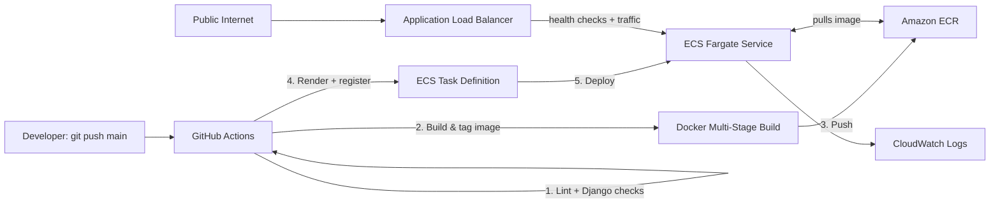

# Django on AWS ECS Fargate — Production-Style CI/CD Deployment


A Django web application deployed on AWS using a fully serverless container pipeline — **Docker → Amazon ECR → Amazon ECS (Fargate) → Application Load Balancer** — with an end-to-end **GitHub Actions CI/CD pipeline** that lints, builds, pushes, and deploys on every push to `main`.

> This is a deliberate step up from a previous EC2-based deployment project: instead of manually managing a server, this project uses AWS's managed container orchestration so there's no OS to patch, no SSH keys to rotate, and rolling deployments/self-healing come built in.

---

## 🏗️ Architecture



**Request flow:** `User → ALB (port 80) → Target Group → ECS Task (port 8000, private IP) → Django/Gunicorn`

**Deploy flow:** `git push → GitHub Actions → ECR → new ECS task definition revision → rolling deployment → old task drains, new task serves traffic`

---

## 🧰 Tech Stack

| Layer | Technology |
|---|---|
| Application | Django 6.0, Gunicorn (WSGI server) |
| Static files | Whitenoise (compressed, hashed static file serving) |
| Containerization | Docker (multi-stage build, non-root user) |
| Container Registry | Amazon ECR |
| Compute | AWS ECS on Fargate (serverless containers) |
| Networking | VPC, public subnets across 2 AZs, 2-tier security groups |
| Load Balancing | Application Load Balancer + Target Group with `/health/` checks |
| CI/CD | GitHub Actions (lint → build → push → deploy) |
| Logging | Amazon CloudWatch Logs |
| IAM | Dedicated ECS task execution role (least-privilege image pull + logging) |

---

## 📁 Project Structure

```
.
├── .github/workflows/
│   └── deploy.yml            # CI/CD pipeline: lint, build, push, deploy
├── core/
│   ├── settings/
│   │   ├── base.py           # Shared settings
│   │   ├── dev.py            # Local development settings
│   │   └── production.py     # Production settings (security hardening)
│   ├── urls.py
│   └── wsgi.py                # Entry point used by Gunicorn
├── portfolio/                  # Django app
│   ├── views.py                # Homepage + /health/ endpoint
│   ├── urls.py
│   └── templates/portfolio/home.html
├── Dockerfile                  # Multi-stage production build
├── docker-compose.yml          # Local container testing
├── requirements.txt
├── .flake8
├── .env.example
└── manage.py
```

---

## 🔐 Security & Production Hardening

- **Non-root container user** — the app runs as an unprivileged `django` user inside the container, not root.
- **Multi-stage Docker build** — build tools (compilers, pip cache) never ship in the final image; only the finished virtual environment does.
- **Split settings** — `DEBUG=True` is only possible in `core.settings.dev`, never in the production settings module used by the container.
- **Locked-down networking** — the ECS task's security group only accepts inbound traffic on port 8000 from the ALB's security group. The public internet cannot reach the container directly under any circumstances, regardless of `Host` header.
- **Security headers** — `X-Frame-Options: DENY`, `X-Content-Type-Options: nosniff`, and HSTS/SSL-redirect settings gated behind an environment variable, ready to enable once a custom domain + TLS certificate is added.
- **Secrets via environment variables** — `DJANGO_SECRET_KEY` and friends are injected at deploy time via the ECS task definition, never hardcoded or committed to Git.

---

## ⚙️ CI/CD Pipeline

Every push to `main` triggers `.github/workflows/deploy.yml`:

1. **Lint & check** — `flake8` for code quality, `python manage.py check` against production settings, to catch config errors before anything gets built.
2. **Build & push** — Docker image built and pushed to ECR, tagged with both `latest` and the Git commit SHA (so every deploy is traceable to an exact commit).
3. **Render task definition** — the current ECS task definition is fetched and updated in-place with the new image, via `aws-actions/amazon-ecs-render-task-definition`.
4. **Deploy** — the new task definition is registered and the ECS service is updated. The pipeline waits for the ALB to confirm the new tasks are healthy before reporting success — a broken deploy fails the pipeline instead of silently leaving bad containers running.

**A real bug this pipeline caught during development:** the ALB's health check calls the container using its private IP as the `Host` header, not the ALB's public DNS name. With `ALLOWED_HOSTS` initially locked to the ALB hostname only, Django correctly rejected those health checks with `400 Bad Request`, and ECS auto-replaced the "unhealthy" task in a loop. Root cause + fix are documented in [Lessons Learned](#-lessons-learned).

---

## 🚀 Local Development

```bash
python -m venv venv
source venv/bin/activate  # Windows: venv\Scripts\activate
pip install -r requirements.txt
python manage.py migrate
python manage.py runserver
```
Visit `http://127.0.0.1:8000/` and `http://127.0.0.1:8000/health/`.

## 🐳 Run with Docker

```bash
docker compose up --build
```

---

## ☁️ AWS Deployment (Manual Steps, for Reference)

The CI/CD pipeline automates all of this, but the underlying AWS resources were built with:

1. `aws ecr create-repository` — container registry
2. `aws iam create-role` + `AmazonECSTaskExecutionRolePolicy` — lets ECS pull images & write logs
3. `aws ecs register-task-definition` — the container "recipe" (image, CPU/memory, port, env vars, logging)
4. `aws ecs create-cluster` — logical grouping for the service
5. `aws elbv2 create-load-balancer` / `create-target-group` / `create-listener` — public entry point + health checks
6. `aws ecs create-service` — ties the task definition to the cluster and load balancer, with rolling deployments

---

## 💰 Cost Management

Unlike a stopped EC2 instance, an **Application Load Balancer bills hourly regardless of traffic** (~$16-20/month), and a **running Fargate task bills continuously** (~$9-10/month at 0.25 vCPU / 0.5GB). To keep this portfolio project at effectively $0 when not being demoed:

```bash
# Scale down the running task
aws ecs update-service --cluster django-cluster --service django-service --desired-count 0

# Remove the load balancer (the main hourly cost)
aws elbv2 delete-listener --listener-arn <listener-arn>
aws elbv2 delete-load-balancer --load-balancer-arn <load-balancer-arn>
```
ECR images, the IAM role, task definitions, security groups, and the ECS cluster/service definitions all remain (free to keep) and can be redeployed in minutes by recreating the ALB, target group, and listener, then scaling the service back up.

---

## 📚 Lessons Learned

- **ALB health checks use the target's private IP as the `Host` header**, not the load balancer's DNS name. If `ALLOWED_HOSTS` is scoped too tightly, Django will reject health checks with `400 DisallowedHost`, and ECS will endlessly cycle "unhealthy" tasks. Since the task's security group already restricts inbound access to ALB traffic only, widening `ALLOWED_HOSTS` in this specific architecture is a deliberate, defensible trade-off rather than a security gap.
- **Two security groups, not one** — separating the ALB's security group (public, port 80) from the task's security group (only accepts traffic from the ALB, port 8000) means the container is never directly reachable from the internet.
- **`ecsTaskExecutionRole` is a distinct concept from application permissions** — it's what lets *ECS itself* pull images and write logs, separate from any IAM permissions the Django app might need at runtime.
- **Static files need `collectstatic` at Docker build time**, not container start time, via Whitenoise — keeps container startup fast and avoids a write-permission dance for a non-root user at runtime.

---

## 🔮 Future Improvements

- Custom domain + ACM certificate for HTTPS (settings are already wired to flip on via `DJANGO_USE_HTTPS`)
- Auto-scaling based on CPU/request count
- Move static/media files to S3 + CloudFront
- RDS PostgreSQL instead of SQLite for a real persistent database
- Blue/green deployments via CodeDeploy instead of ECS rolling updates

---

## 📄 License

MIT
